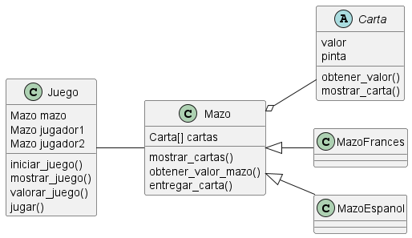
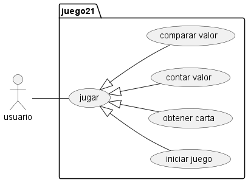

# Ventiuna
-Santiago Alexander Garcia Liscano Código 20231020189 
-Andres Esteban Rodriguez Avila Código 20231020088
El juego de 21 es un juego de cartas con una o mas barajas
En esta version simularemos un 21 de un jugador vs el repartidor.
El repartidor estara obliado a pedir cartas hasta igualar al jugador y solo se plantara cuando lo iguale o supere.
El jugador solo podra ganar si tiene mejor puntaje que el repartidor pero sin pasarse de 21.
las cartas numericas suman su valor, las figuras como _"J,Q,K"_ suman 10 y el az vale 1 o 11 segun convenga, solo puede valer 11 si con este valor
no excede el valor de 21 de lo contrario solo suma 1.
## Diagramas:
 
- Diagrama de clases:
- Diagrama de casos de uso:
 
- Diagrama de Secuencia
  
